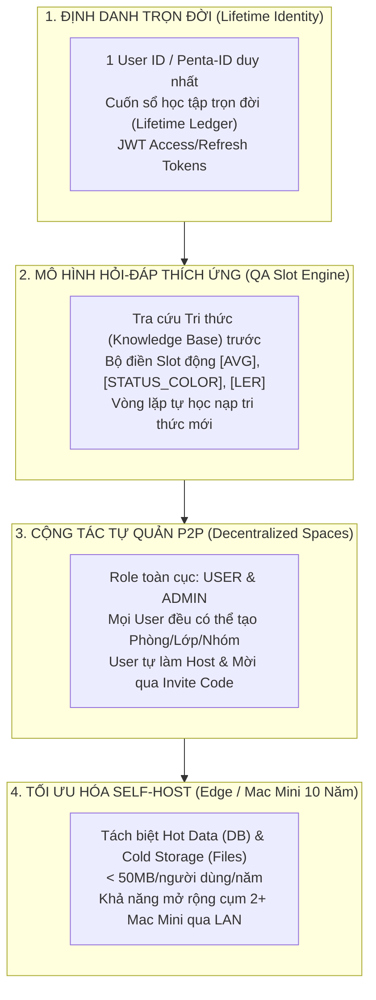

# Kiến trúc Toàn Hệ sinh thái Penta AI (Cập nhật ngày 18/09/2026)

Tài liệu này xác lập **4 Chuẩn Kiến trúc Cốt lõi (Foundational Standards)** áp dụng thống nhất cho toàn bộ hệ sinh thái Penta AI (`pentami-core`, `pentaschool`, `pentanote`, `pentakuru`, `pentamarket`, `pentajob`).

---

## 1. Bốn Chuẩn Kiến trúc Toàn Hệ thống (Core Architectural Standards)

---

## 2. Ứng dụng Chuẩn Kiến trúc cho Các Phân Hệ Vệ Tinh

| Phân hệ | Ứng dụng Định danh Trọn đời (S1) | Ứng dụng QA Slot Engine (S2) | Ứng dụng Cộng tác P2P (S3) |
| :--- | :--- | :--- | :--- |
| **Pentaschool** | Hồ sơ học tập K12/Đại học, chỉ số `LER` cá nhân hóa. | Tra cứu bài giảng, giải bài tập Lịch sử, Toán... Điền biến `[AVG]`, `[STATUS_COLOR]`. | User tự tạo Lớp học / Nhóm ôn thi, làm Host mời bạn bè. |
| **Pentanote** | Sổ tay ghi chép, flashcards, mindmap gắn với `Penta-ID`. | Tự động tóm tắt ghi chú, trích xuất slot ý chính. | Chia sẻ sổ tay, tạo không gian ghi chép nhóm. |
| **PentaKuRu** | Thư viện tài liệu cá nhân hóa suốt cuộc đời. | Tra cứu tài liệu ngữ nghĩa (Vector RAG), trích xuất tóm tắt. | Nhóm đọc sách / trao đổi tài liệu nghiên cứu. |
| **PentaJob** | Hồ sơ năng lực (Portfolio), kỹ năng tích lũy qua năm tháng. | Khớp lệnh CV với tin tuyển dụng, gợi ý lộ trình kỹ năng. | Nhà tuyển dụng / Trưởng nhóm tự mở kênh tuyển dụng P2P. |
| **PentaMarket** | Lịch sử giao dịch học liệu, chứng chỉ số. | Định giá tự động, tra cứu hóa đơn, tính toán `[AVG_PRICE]`. | User tự mở gian hàng giáo trình, khóa học cá nhân. |

---

## 3. Trạng thái Triển khai Hiện tại (Implementation Status)

### Đã hoàn thành (Implemented & Verified trên nhánh `dev`):
* `shared/models/user.py`: Mô hình `UserLifetimeLedger`, `LearningStyleLER`, `MilestoneRecord`, `UserRole` (`USER`, `ADMIN`).
* `shared/models/classroom.py`: Mô hình Lớp học P2P (`Classroom`, `ClassroomResponse`).
* `shared/auth/jwt_auth.py`: Quản lý JWT Access Token, Refresh Token, mã hóa mật khẩu PBKDF2-HMAC-SHA256.
* `pentami-core/backend/qa_engine.py`: Engine QA tra cứu Knowledge Base, giải quyết Slot động (`[STUDENT_NAME]`, `[AVG]`, `[STATUS_COLOR]`, `[LER_ACTION]`) và tự động nạp tri thức mới (`harvest_knowledge`).
* `pentami-core/backend/main.py`: Các endpoints Auth (`/register`, `/login`, `/refresh`), User Ledger (`/me`, `/ler`), P2P Classroom (`/classrooms`, `/join`, `/my`) và Chat cá nhân hóa (`/chat`).
* Bộ kiểm thử `pentami-core/backend/tests/`: 15/15 bài test đã PASS 100%.

### Hạ tầng Local (`deploy/`):
* Docker Compose cho PostgreSQL (5432), Redis (6379), Qdrant (6333, 6334) sẵn sàng phục vụ mở rộng.
