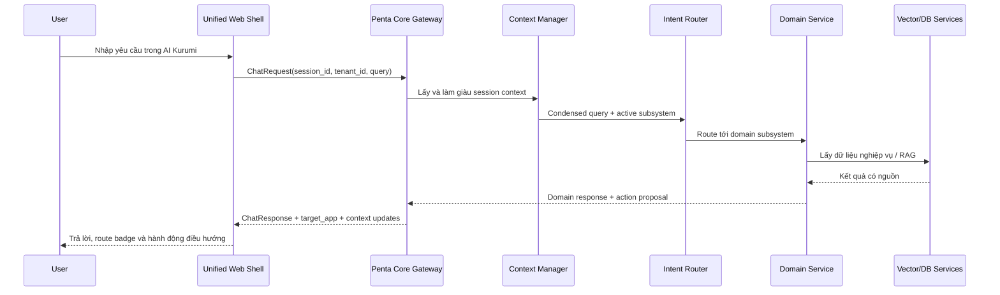

# Unified Workspace và AI Kurumi

## 1. Mục tiêu

AI Kurumi là điểm vào hội thoại chung của toàn bộ hệ sinh thái Penta AI. Người dùng có thể hỏi một lần trong cùng giao diện, còn `pentami-core` sẽ xác định phân hệ phù hợp và giữ ngữ cảnh khi chuyển từ hệ thống này sang hệ thống khác.

# Unified Workspace (Target Architecture)

> Đây là thiết kế mục tiêu, không phải mô tả runtime hiện tại. Backend hiện chỉ có health, app catalog và chat echo; session, tenant, intent routing và `target_app` vẫn là roadmap.

## 2. Trải nghiệm người dùng


UI prototype hiện nằm tại `pentami-core/frontend/` và gọi `POST /api/chat`.

## 3. Luồng kiến trúc



## 4. Hợp đồng context xuyên hệ sinh thái

Mỗi request chat nên có:

```json
{
  "session_id": "sess_...",
  "tenant_id": "tenant_...",
  "user_id": "usr_...",
  "active_app": "pentanote",
  "active_resource": "page_...",
  "query": "...",
  "conversation_turn_id": "turn_...",
  "client_capabilities": ["navigate_app", "open_document"]
}
```

Context cần được chia thành hai loại:

- **Conversation context**: câu hỏi, câu trả lời, intent, persona, lịch sử ngắn.
- **Work context**: app hiện tại, tài liệu đang mở, khóa học, sản phẩm, CV, tenant và quyền truy cập.

Không đưa toàn bộ dữ liệu của tất cả hệ thống vào prompt. Chỉ lấy phần context cần thiết theo intent và scope.

## 5. Quy tắc chuyển hệ thống

1. Context manager chuẩn hóa câu hỏi trước khi định tuyến.
2. Intent router xác định `target_app`.
3. Domain service chỉ đọc dữ liệu mà tenant và user được quyền đọc.
4. Action chuyển app phải được biểu diễn bằng action contract, không hardcode URL trong frontend.
5. Action nhạy cảm như thanh toán, nộp hồ sơ, xóa dữ liệu hoặc thao tác web bắt buộc xác nhận người dùng.
6. Khi chuyển app, session vẫn giữ nguyên nhưng `active_app` thay đổi.

## 6. Trạng thái hiện tại và phần còn thiếu

### Đã có

- UI launcher và panel chat dùng chung.
- `POST /api/chat` và response có `target_app`.
- Frontend gửi `session_id` và `tenant_id`.
- Backend có module memory và context condenser.

### Cần hoàn thiện

- Gọi `MemoryContextManager` trong route `/api/chat`.
- Lưu conversation vào Redis/PostgreSQL thay vì chỉ giữ in-memory.
- Thêm `active_app`, `active_resource` và quyền vào request.
- Kết nối router với service thật thay cho keyword routing.
- Trả về citation/source khi dùng RAG.
- Tạo action confirmation flow cho MCP và nghiệp vụ nhạy cảm.
