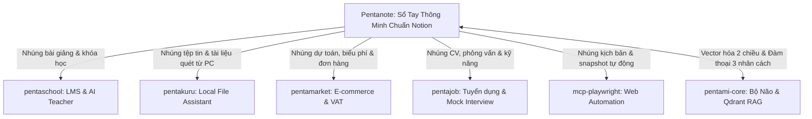

# Pentanote (100% Notion-like Block-based AI Workspace)

> **Định Hướng Chiến Lược:** Pentanote được thiết kế và phát triển **giống Notion 100%** về mặt trải nghiệm người dùng, kiến trúc dữ liệu dạng khối (Block-based Tree), không gian làm việc kéo thả, cơ chế Slash Commands (`/`) và hệ thống Database đa chế độ (Table, Board, Gallery, Calendar), đồng thời tích hợp trí tuệ nhân tạo **AI Native** từ lõi `pentami-core`.

---

## 🏛️ 1. Kiến Trúc Dữ Liệu Dạng Khối (Notion-grade Block Engine)

Mọi phần tử trong Pentanote đều là một **Block** độc lập có định danh UUID riêng biệt và hỗ trợ cấu trúc cây phân cấp (Tree Hierarchy) lồng nhau vô hạn:

```json
{
  "id": "block_9f8a1c9e_4b2d",
  "parent_id": "page_root_123",
  "type": "callout",
  "properties": {
    "title": "Ghi chú quan trọng",
    "icon": "💡",
    "color": "blue_background"
  },
  "content": [
    {"type": "text", "text": "Nội dung ghi chú hỗ trợ ", "annotations": {"bold": false}},
    {"type": "text", "text": "công thức LaTeX", "annotations": {"bold": true, "code": true}}
  ],
  "children": ["block_sub_001", "block_sub_002"]
}
```

### Các Loại Block Được Hỗ Trợ 100%:
*   **Văn bản & Tiêu đề**: `paragraph`, `heading_1`, `heading_2`, `heading_3`
*   **Danh sách & Tương tác**: `to_do` (checkbox), `bulleted_list_item`, `numbered_list_item`, `toggle` (danh sách đóng/mở nội dung)
*   **Định dạng nâng cao**: `callout` (kèm icon & màu nền), `quote` (trích dẫn), `divider` (đường kẻ ngang), `code` (syntax highlight đa ngôn ngữ)
*   **Toán học & Khoa học**: `equation` / `math_inline` (hỗ trợ hiển thị công thức LaTeX `$$`)
*   **Media & Tệp tin**: `image`, `video`, `file`, `pdf_viewer`, `web_bookmark`
*   **Bố cục đa cột**: `column_list`, `column` (kéo thả chia 2, 3, 4 cột song song)

---

## ⚡ 2. Trải Nghiệm Thao Tác (Notion UX/UI Interaction)

1. **Menu Lệnh Nhanh Slash Command (`/`)**:
   - Nhấn phím `/` tại bất kỳ dòng nào để mở popover chọn nhanh loại block:
     - `/h1`, `/h2`, `/h3`: Đổi định dạng tiêu đề
     - `/todo`: Tạo danh sách công việc có tích chọn
     - `/toggle`: Tạo khối đóng/mở thông tin
     - `/table`: Chèn bảng dữ liệu
     - `/ai`: Kích hoạt AI trợ lý từ `pentami-core` để viết tiếp, tóm tắt hoặc dịch thuật.
2. **Tay Cầm Kéo Thả 6 Chấm (6-Dot Drag Handle)**:
   - Di chuột vào đầu dòng xuất hiện icon 6 chấm để kéo thả sắp xếp lại thứ tự các block hoặc kéo sang ngang để tự động chia cột.
3. **Trang Lồng Trang Vô Hạn (Infinite Nested Pages)**:
   - Cho phép tạo trang con bên trong trang cha không giới hạn cấp bậc (`/page`).
   - Breadcrumb điều hướng phân cấp trực quan ở đầu trang.

---

## 📊 3. Hệ Thống Database Đa Chế Độ (Notion Databases & Views)

Pentanote cung cấp hệ cơ sở dữ liệu linh hoạt, cho phép cùng một nguồn dữ liệu hiển thị qua nhiều góc nhìn (Multi-views):

*   📋 **Table View**: Dạng bảng tính cổ điển, hỗ trợ lọc (Filter), sắp xếp (Sort) và nhóm (Group).
*   📌 **Board View (Kanban)**: Dạng thẻ kéo thả theo trạng thái (To-do, In-progress, Done).
*   🖼️ **Gallery View**: Dạng thẻ card trực quan có ảnh bìa hoặc bản xem trước.
*   📅 **Calendar / Timeline View**: Quản lý lịch trình, hạn chót bài tập và ôn tập thi cử.
*   📝 **List View**: Dạng danh sách tối giản, tải nhanh.

### Các Kiểu Thuộc Tính (Properties) Chuẩn Notion:
*   `Title`, `Text`, `Number`, `Select`, `Multi-select`, `Status`
*   `Date`, `Person`, `Files & Media`, `Checkbox`, `URL`, `Email`, `Phone`
*   `Formula` (Công thức tính toán tự động)
*   `Relation` (Liên kết chéo 2 Database) & `Rollup` (Tổng hợp dữ liệu từ bảng liên kết)

---

## 🌐 4. Trục Giao Thoa Tri Thức: Liên Kết Toàn Bộ Dự Án (Ecosystem Integration)

Pentanote **không phải là ứng dụng ghi chú đơn lẻ**, mà là **TRỤC GIAO THOA TRI THỨC TRUNG TÂM** của toàn bộ Hệ Sinh Thái Penta AI. Nó đóng vai trò là "cuốn sổ tay số vạn năng" kết nối trực tiếp với 6 phân hệ vệ tinh:



### Chi Tiết Cơ Chế Liên Kết Từng Phân Hệ:

1. **Liên kết với `pentaschool` (Giáo dục & Đào tạo)**:
   * **Học sinh**: Ghi chép bài giảng, tổ chức tài liệu học tập vào Pentanote, tra cứu kiến thức qua RAG và lưu lời giải vào sổ tay.
   * **Giáo viên**: Soạn giáo án, đề cương môn học dạng trang Notion rồi bấm nút `Publish to Pentaschool` để biến thành khóa học chính thức.
2. **Liên kết với `pentakuru` (Tài liệu & Máy tính cá nhân)**:
   * Khối `[pentakuru:file]` cho phép nhúng bản tóm tắt và đường dẫn mở nhanh tệp tin (PDF, DOCX, Code) từ máy tính của người dùng trực tiếp vào trang ghi chú.
   * Ngược lại, công cụ tìm kiếm của Pentakuru có thể quét qua toàn bộ cơ sở dữ liệu của Pentanote để tra cứu siêu tốc.
3. **Liên kết với `pentamarket` (Tài chính & Thương mại)**:
   * Sử dụng Database của Pentanote để lập bảng dự toán chi phí học tập, quản lý ngân sách mua sắm sách vở, khóa học và thiết bị.
   * Nhúng mã giảm giá (voucher) và biểu phí trường học vào block ghi chú để theo dõi thanh toán.
4. **Liên kết với `pentajob` (Việc làm & Phát triển sự nghiệp)**:
   * Tạo trang "Portfolio & CV cá nhân" chuẩn Notion, theo dõi tiến độ ứng tuyển việc làm (Kanban Board).
   * Lưu trữ nhật ký và nhận xét sau các buổi phỏng vấn thử nghiệm giọng nói (Mock Interview).
5. **Liên kết với `mcp-playwright` (Tự động hóa trình duyệt)**:
   * Nhúng khối hành động tự động: Trích xuất lịch thi từ cổng thông tin nhà trường, tự động lưu bảng điểm online vào một trang Pentanote.
6. **Liên kết với `pentami-core` (Bộ Não & RAG Đa Chiều)**:
   * **Unified Security**: Mọi trang và database được bảo mật và phân quyền bằng `penta_live_sk_...` cách ly tuyệt đối giữa các trường học/người dùng (`tenant_id`).
   * **Vector RAG 2 chiều**: Toàn bộ ghi chú được tự động phẳng hóa và vector hóa lên Qdrant (`all-MiniLM-L6-v2`), cho phép người dùng hỏi đáp trực tiếp với chính sổ tay của mình thông qua giọng điệu 3 nhân cách (**Cute, Serious, Yandere**).

---

## 📁 5. Cấu Trúc Thư Mục Chuẩn Phân Hệ

```text
pentanote/
├── README.md                                  # Tài liệu kiến trúc Notion 100%
├── datasheet/ -> dataset/                     # Thư mục liên kết datasheet
├── dataset/                                   # Dữ liệu mẫu trang & block
│   ├── smart_notes/                           # Dữ liệu ghi chú phân cấp
│   ├── flashcards/                            # Dữ liệu thẻ nhớ sinh ra từ block
│   ├── mindmaps_knowledge_graphs/             # Dữ liệu đồ thị liên kết trang
│   └── summaries/                             # Bản tóm lược nội dung trang
└── src/                                       # Mã nguồn theo chuẩn Guru Factory
    ├── interface.py                           # Hợp đồng Block, Page, Database
    ├── implementation.py                      # Block Tree Engine & Slash Parser
    ├── factory.py                             # PentanoteFactory
    └── registry.py                            # PentanoteRegistry
```
